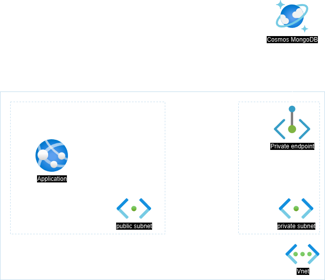
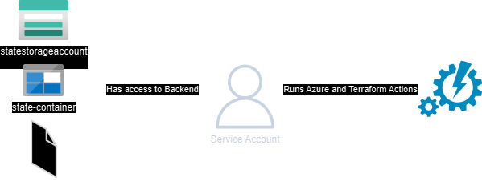
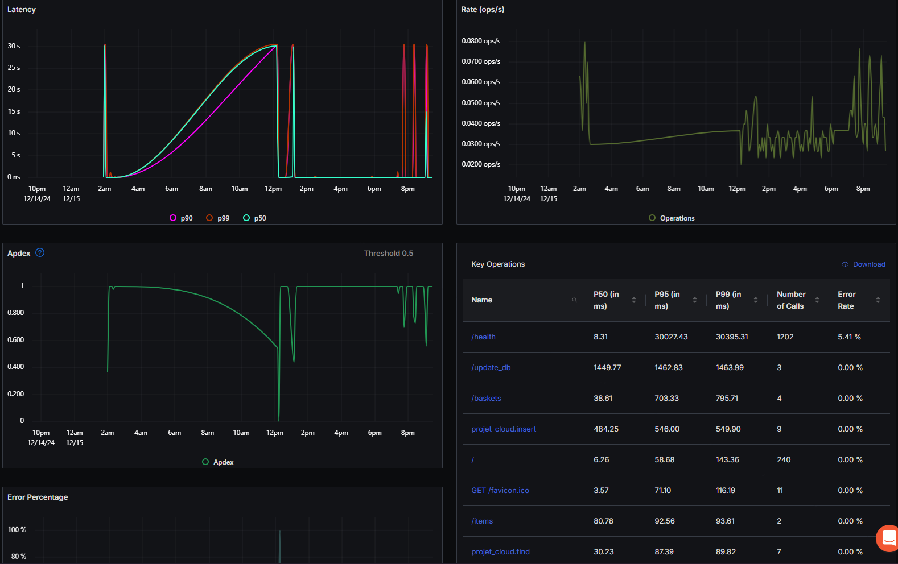

# Shop App API on Azure cloud <!-- omit in toc -->

This project demonstrates a simple application deployed on Azure using Terraform. Students will fork this repository to complete their assignments.

- [Project Structure](#project-structure)
- [Getting Started](#getting-started)
  - [Prerequisites](#prerequisites)
  - [Running the Application Locally](#running-the-application-locally)
  - [Running the Tests Locally](#running-the-tests-locally)
- [Overview](#overview)
  - [Infrastructure](#infrastructure)
  - [CI/CD](#cicd)
  - [Monitoring](#monitoring)
- [Resources](#resources)


## Project Structure

- `api/`: Contains the Flask application code.
- `infrastructure/`: Contains the Terraform code to provision Azure infrastructure.
- `.github/`: Contains GitHub Actions workflows for CI/CD.

## Getting Started

### Prerequisites

- Python 3.10 or later
- Terraform 1.5 or later
- Azure account

### Running the Application Locally

1. Install dependencies
  
    ```bash
    pip install -r api/requirements.txt
    ```

2. Setup Environmnent variables

    |NAME|DESCRIPTION|DEFAULT|
    |---|---|---|
    |MONGO_URL|MongoDB uri to connect to an instance.||

3. Run the app
  
    ```bash
    python api/app.py
    ```

### Running the Tests Locally

1. Install pytest
  
    ```bash
    pip install pytest
    ```

2. Run tests using pytest
  
    ```bash
    pytest api/tests
    ```

## Overview

### Infrastructure

  The provisioned architecture creates an app service with a System Managed identity and a CosmosDB Database with a MongoDB instance. The CosmosDB is private only accessible through a private endpoint available in the private subnet. Furthermore the identity is assigned to a custom role with read and write access.

  

### CI/CD

  Our project uses a single main workflow ci-workflows.yml to run 4 different stages : lint, test, build and deploy.
  During the deploy job we use a service account created using a Free account to provision resource through the CI/CD since the JUNIA Tenant
  blocks access to our Client Secrets required to authenticate inside of a pipeline.

  

### Monitoring

  To respect the monitoring requirement we chose OpenTelemetry as our solution. The neccessary environmnet variable are passed
  through the app_settings option in terraform with the access token being a github secret. Below is an example of our project
  metrics after 24h of deployment.
  
  

## Resources

  Used this [tutorial](https://docs.github.com/en/packages/managing-github-packages-using-github-actions-workflows/publishing-and-installing-a-package-with-github-actions) for pushing docker image to packages.
  Used a variety of Azure documentation and videos from [John Savill](https://www.youtube.com/@NTFAQGuy) to help understand and provision correctly.
