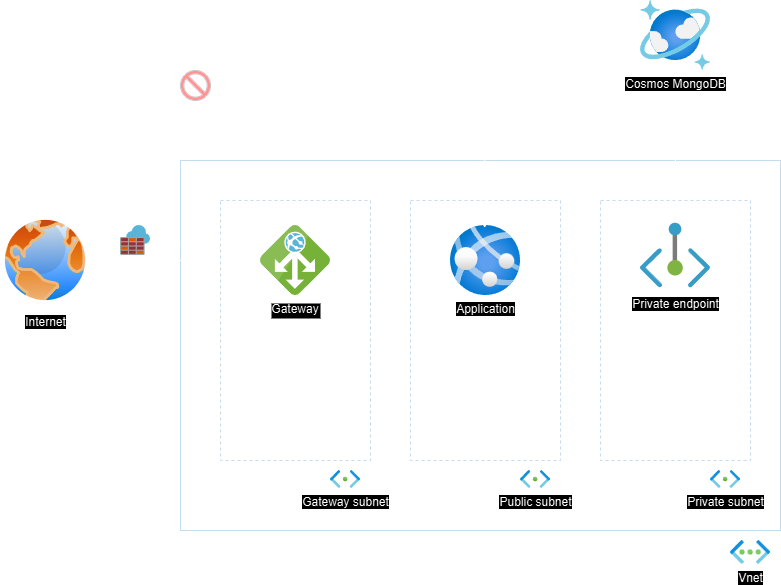

# Shop App API on Azure cloud

This project demonstrates a simple application deployed on Azure using Terraform. Students will fork this repository to complete their assignments.

## Project Structure

- `api/`: Contains the Flask application code.
- `infrastructure/`: Contains the Terraform code to provision Azure infrastructure.
- `.github/`: Contains GitHub Actions workflows for CI/CD.

## Getting Started

### Prerequisites

- Python 3.9 or later
- Terraform 1.5 or later
- Azure account

### Running the Application Locally

1. Install dependencies
  
    ```bash
    pip install -r api/requirements.txt
    ```

2. Run the app
  
    ```bash
    python api/app.py
    ```

### Running the Tests Locally

1. Install pytest
  
    ```bash
    pip install pytest
    ```

2. Run tests using pytest
  
    ```bash
    pytest api/tests
    ```

### Infrastructure

The provisioned architecture creates an app service with a System Managed identity and a CosmosDB Database with a MongoDB instance. The CosmosDB is private only accessible through a private endpoint available in the private subnet. Furthermore the identity is assigned to a custom role with read and write access.



### Resources

Used this [tutorial](https://docs.github.com/en/packages/managing-github-packages-using-github-actions-workflows/publishing-and-installing-a-package-with-github-actions) for pushing docker image to packages.